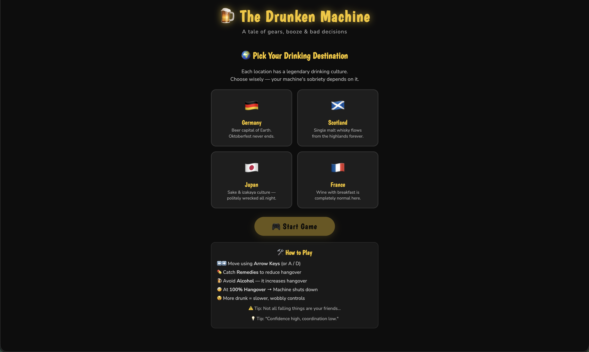
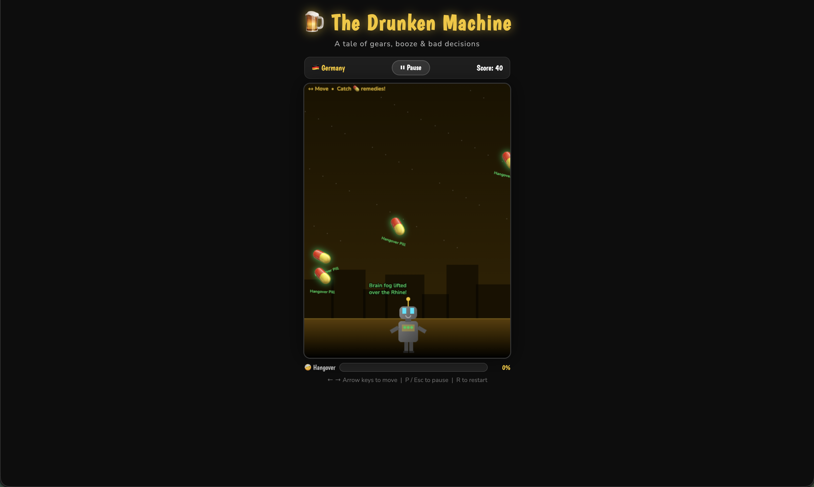

# 🍺 The Drunken Machine

> A chaotic tale of a machine running on alcohol instead of logic.

---

## 🎮 About the Game

**The Drunken Machine** is a fast-paced HTML5 browser game where you control a malfunctioning machine struggling to stay operational.

Alcohol is everywhere.
So are remedies.

Choose wisely.

* 🍺 Alcohol → increases hangover & reduces control
* 💊 Remedies → stabilize the system
* 🤕 At 100% hangover → **SYSTEM FAILURE**

---

## 🧠 Theme (Game Jam)

**Theme:** *Machine*

This game interprets the theme as:

> A machine behaving unpredictably under intoxication — simulating system instability, degraded performance, and chaotic control.

---

## 🕹️ Gameplay Features

* ⚙️ Drunk physics (wobble + delayed movement)
* 🌍 Multiple themed environments:

  * 🇩🇪 Germany (Beer)
  * 🏴 Scotland (Whisky)
  * 🇯🇵 Japan (Sake)
  * 🇫🇷 France (Wine)
* 🔊 Dynamic sound effects (Web Audio API)
* 🎯 Increasing difficulty over time
* 💬 Funny real-time reaction messages
* 📊 Hangover meter system

---

## 🎮 Controls

| Action     | Key         |
| ---------- | ----------- |
| Move Left  | ← Arrow / A |
| Move Right | → Arrow / D |
| Pause      | P / Esc     |
| Restart    | R           |

> ⚠️ Click on the game screen to activate controls (important for browser play)

---

## 🚀 How to Run

### ▶️ Option 1: Direct

Open the game in your browser:

```bash
index.html
```

---

### 🌐 Option 2: Local Server (Recommended)

```bash
python -m http.server 8000
```

Then open:

```
http://localhost:8000
```

---

## 📁 Project Structure

```
/drunken-machine
  index.html
```

---

## 🛠 Tech Stack

* HTML5 Canvas
* Vanilla JavaScript
* CSS3
* Web Audio API

No external libraries. No frameworks. Pure chaos.

---

## 🎯 Goal

Survive as long as possible without letting the hangover reach 100%.

---

## 🧪 Known Issues

* Arrow keys may not work until canvas is focused (click once)
* Performance may vary on low-end devices

---

## 🔥 Future Improvements

* Mobile touch joystick controls
* Power-ups & special abilities
* Leaderboard system
* More environments & effects

---

## 🙌 Credits

Developed by **Andrews**
Built for a game jam 🚀

---

## 📸 Screenshots




## 🧠 Final Words

> “It’s not a bug. It’s intoxicated behavior.”

Good luck keeping the machine alive.
